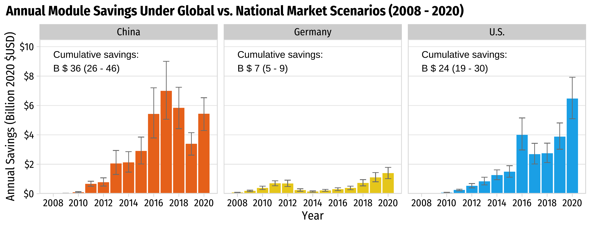

```{r, child="setup.Rmd"}
```

layout: true

<!-- this adds the link footer to all slides, depends on my-footer class in css-->

<div class="footer-small">
<span>
© John Paul Helveston, The George Washington University, June 2025
</span>
</div>

---

background-image: url("images/blue.jpg")
background-size: cover
class: inverse

<br><br><br><br>

## `r rmarkdown::metadata$title`

<br><br><br><br>

**.white[John Paul Helveston]**, George Washington University

`r rmarkdown::metadata$date`

---

class: middle, center, inverse

# What if the "free" flow of<br>capital, talent, and innovation<br>across boarders is no longer "free"?

---

# .center[A Changing Political Reality]

### **2000s Globalization**

- Free flow of capital, talent, innovation
- Technology spillovers across borders

--

### **2010s Push Back Against Globalization**

- Economic security concerns (manufacturing job loss)
- Competition with China 

--

### **2020s Post-COVID Fragmentation**

- Supply chain resilience and "Friend-shoring"
- Industrial policy competition
- Defense concerns ("Dual Use")

]

---

## .center[Manufacturing job loss (~5M since 2000)]

- Long term economic transition towards services
- "Hollowing out" of US industrial base

<center>

</center>

https://en.wikipedia.org/wiki/Manufacturing_in_the_United_States

---

## .center[Rise Chinese dominance in clean tech supply chains]

.leftcol[

#### .center[EV battery supply chain]

<center>

</center>

.font80[Cheng, Anthony L., et al. "Electric vehicle battery chemistry affects supply chain disruption vulnerabilities." Nature Communications 15.1 (2024): 2143.]

]

.rightcol[

#### .center[Solar module supply chain]

<center>

</center>

.font80[IEA Special report 2022: Solar PV Global Supply Chains, https://www.iea.org/reports/solar-pv-global-supply-chains]

]

---

class: middle, center, inverse

# New Political Reality:

<br>

# Nationalism > Globalization

## (Security > Efficiency)

---

# .center[**Bipartisan goal**: The US needs to counter China's lead in clean energy tech]

<br>

--

## **Keep Chinese clean tech out of US market**: Steep tariffs on imported Chinese EVs, batteries, PV modules

--

## **Keep Chinese firms out of US clean tech supply chains**: IRA restrictions on EV subsidy elligiblity, stricter Foreign Entities of Concern (FEOC) rules

---

# .center[Countering China by Investing in Manufacturing]

<br>

## **IRA Strategy**: Investing in *manufacturing* will lead to enduring support for clean tech through local jobs & economic benefits

<br>

--

## ...this stratgey hasn't entirely worked 😔<br>(2 years wasn't enough time)

---

class: inverse, middle, center

# Solar PV

---

# Phase 1: Early Trade Disputes (2010-2015)

- US a major solar manufacturer and polysilicon producer
- 2012: Obama imposes 24-36% tariffs on Chinese solar panels
- China retaliates with tariffs on US polysilicon exports
- Chinese manufacturers continue scaling, US polysilicon industry contracts.

--

# Phase 2: Circumvention Era (2015-2020)

- China becomes dominant manufacturer, 80%+ of solar supply chain
- Chinese companies use "transhipment" through SE ASia to avoid US tariffs

--

# Phase 3: Bidenomics? / IRA (2020-Now)

---

class: center, middle

### Shift from China to SE Asia (Transhipment)

<center>

</center>

.font80[Source: https://www.reuters.com/graphics/USA-CHINA/SOLAR-HISTORY/gdpzkdeqlvw/]

---

# We need diversification

<br>

## China has enough solar PV capacity to meet annual global demand through 2032.

Source: Wood Mackenzie, https://www.reuters.com/world/china/china-will-dominate-solar-supply-chain-years-wood-mackenzie-2023-11-07/

--

<br>

## But do we need _onshoring_?

---

## Solar PV

### Total available U.S. federal subsidies: $0.16 / W

### Average U.S. module price (Q1 2024): $0.33 / W

<br><br><br><br>

Sources:

- https://www.nrel.gov/docs/fy24osti/91209.pdf
- Michael Davidson, “U.S.-China Clean Energy Race: Accelerating Innovation, Manufacturing and Adoption”, https://web.sas.upenn.edu/future-of-us-china-relations/climate-and-environment/

---

## Solar PV

### Total available U.S. federal subsidies: $0.16 / W

### Average U.S. module price (Q1 2024): $0.33 / W

### Average cost of production in China: **$0.10 / W**

<br><br>

Sources:

- https://www.nrel.gov/docs/fy24osti/91209.pdf
- Michael Davidson, “U.S.-China Clean Energy Race: Accelerating Innovation, Manufacturing and Adoption”, https://web.sas.upenn.edu/future-of-us-china-relations/climate-and-environment/

---

## Solar PV

### Total available U.S. federal subsidies: $0.16 / W

### Average U.S. module price (Q1 2024): $0.33 / W

### Average cost of production in China: $0.10 / W

### **Risk: U.S. producers unlikely to be globally competitive**

Sources:

- https://www.nrel.gov/docs/fy24osti/91209.pdf
- Michael Davidson, “U.S.-China Clean Energy Race: Accelerating Innovation, Manufacturing and Adoption”, https://web.sas.upenn.edu/future-of-us-china-relations/climate-and-environment/

---

background-color: #fff

## Solar unlikely to produce desired # of manufacturing jobs

.leftcol70[

<center>

</center>

]

.rightcol30[

### Installation and project development accounts for 2/3 of solar jobs.

### **Manufacturing is 12% of solar jobs**

.footer[https://irecusa.org/census-solar-job-trends/]

]

---

class: center, middle
background-color: #FFFFFF

## U.S.: 26%; China: 33%; Germany: 20%

<center>

</center>

---

class: middle
background-color: #FFFFFF

<center>

</center>

**Higher prices in 2020**:

- 54% higher in China ($387 versus $250 per kW)
- 83% in higher Germany ($652 versus $357 per kW)
- 107% higher in the U.S. ($877 versus $424 per kW)

---

class: middle, center
background-color: #FFFFFF

## **Total Savings: $67 billion ($50 - $84 billion)**

<center>

</center>

.left[Helveston, J.P., He, G., & Davidson, M.R. (2022) “Quantifying the cost savings of global solar photovoltaic supply chains” _Nature_. 612 (7938), pg. 83-87. DOI: [10.1038/s41586-022-05316-6](https://doi.org/10.1038/s41586-022-05316-6)]

---

class: inverse, middle, center

# Electric Vehicles

---

background-color: #fff

<center>

</center>

---

background-color: #fff

## .center[EV sales in US reaching ~10% of sales]

<center>

</center>

.font80[Source: Argonne National Lab, https://www.anl.gov/ev-facts/model-sales]

---

class: center

.leftcol70[

<center>

</center>

.font70[Source: https://www.iea.org/reports/global-ev-outlook-2024/executive-summary]

]

.rightcol30[

### The EV sector has an affordability problem<br>(except in China)

]

---

class: center

### China offers more affordable BEVs across all range categories

<center>

</center>

Data scraped from autocango.com (China) and carsheet.io (USA)

---

class: center

### China offers more affordable BEVs across all range categories

<center>

</center>

Data scraped from autocango.com (China) and carsheet.io (USA)

---

class: center

### China offers more affordable BEVs across all range categories

<center>

</center>

Data scraped from autocango.com (China) and carsheet.io (USA)

---

background-image: url("images/top-four-1.png")
background-size: cover

---

background-image: url("images/top-four-2.png")
background-size: cover

---

# Strategic Implications

<br>

### **Global Market Share Erosion**: U.S. autos will not be competitive abroad without affordable EVs

<br>

### **Trade Imbalance**: U.S. could go from net vehicle _exporter_ to _importer_ 

### (U.S. exported $15B in vehicles and parts to Canada in 2024 🇨🇦)

<br>

### **Exployment Impacts**:  U.S. auto employs 10.1 million Americans, $730B in annual paychecks

---

## .center[**Opportunities**]

.leftcol[

## Chinese FDI into U.S.

### **Gotion batteries**: Multi-billion dollar investments in Illinois and Michigan

### **Challenge**: Uncertainty around Foreign Entities of Concern (FEOC) status

]

--

.rightcol[

## Technology Licensing Agreements

### **Ford-CATL**: Licensing battery technology in a Michigan plant

### **Challenge**: CATL was recently added to DOD's list of “Chinese military companies”

]

---

class: center, middle, inverse

# Leveraging vehicle listings data to build a dashboard of US EV market development

---

class: middle

.leftcol[

## .center[EVs depreciate faster than gas cars]

.font80[Roberson, Laura A., Pantha, S., & Helveston, J.P. (2024) “Battery-Powered Bargains? Assessing Electric Vehicle Resale Value in the United States” _Environmental Research Letters_ DOI: [10.1088/1748-9326/ad3fce](https://doi.org/10.1088/1748-9326/ad3fce)]

]

.rightcol[

## .center[EV owners drive their cars less than gas car owners]

.font80[Zhao, L., Ottinger, E., Yip, A., & Helveston, J.P. (2023) “Quantifying electric vehicle mileage in the United States” _Joule._ 7, 1–15. DOI: [10.1016/j.joule.2023.09.015](https://doi.org/10.1016/j.joule.2023.09.015)]

]

---

class: center
background-color: #fff

## BEVs Concentrated in High-Price Segments in US

**Only 1.2% of new and 3.5% of used listings under $40,000 were BEVs in 2024**

<center>

</center>

.font80[Data pulled from ~80k dealerships, 2016 to 2024. Source: marketcheck.com]

---

class: center
background-color: #fff

<center>

</center>


---

class: middle, center

# Key Takeaways

---

# Three Main Points

<br>

### **1. Globalization delivered massive cost savings**

$67 billion for solar PV alone (2008-2020)

--

<br>

### **2. Fragmentation will slow progress and increase costs**

--

<br>

### **3. Models need updating to reflect new trade realities**

Political economy cannot be ignored

---

class: inverse
background-image: url("images/blue.jpg")
background-size: cover

<br>

# Thanks!

<br>

### <span class="white-text">https://jhelvy.github.io/2025-snowmass</span>

<style>
.white-text a {
  color: white !important;
}
</style>

.footer-large[.white[.right[

@jhelvy.bsky.social `r fa(name = "bluesky", fill = "white")`<br>
@jhelvy `r fa(name = "github", fill = "white")`<br>
jhelvy.com `r fa(name = "link", fill = "white")`<br>
jph@gwu.edu `r fa(name = "paper-plane", fill = "white")`

]]]

---

class: inverse, middle, center

# Extra Slides

---

### .center[War in Ukraine]

.leftcol[

- Drones now a clear tactical advantage
- Reliance on Chinese supply now a defense issue

<center>

</center>

.font80[https://www.bbc.com/news/articles/ckgn47e5qyno]

]

.rightcol[

<center>

</center>

.font80[https://arc-group.com/china-thriving-drone-industry/]

]

---

## .center[Shift from China to SE Asia (Transhipment)]

.leftcol40[

### Chinese firms still leading producers, but manufacturing shifts to SE Asia to skirt US tariffs

<br><br><br><br>

.font80[Source: https://www.reuters.com/graphics/USA-CHINA/SOLAR-HISTORY/gdpzkdeqlvw/]

]

.rightcol60[

<center>

</center>

]

---

## .center[Shift from China to SE Asia (Transhipment)]

.leftcol40[

### Solar prices in US are much higher than in China

<br><br><br><br><br><br>

.font80[Source: https://www.reuters.com/graphics/USA-CHINA/SOLAR-HISTORY/gdpzkdeqlvw/]

]

.rightcol60[

<center>

</center>

]

---

background-color: #FFFFFF

## .center[Learning curve model]

.leftcol60[

<center>

</center>

]

.rightcol40[

In context of solar PV:

- X: Cumulative installed cap.
- Y: = Price per kW

<br>

Log transformation:

$$\ln Y = \ln a + b \ln X$$

]

---

## Two-factor learning curve model:

<br>

## $$\ln p_{it} = \ln \alpha_i + \beta_i \ln q_{t} + \gamma_i \ln s_{t} + \varepsilon_{it}$$

<br>

## price ($ / kW) = intercept + installed capacity + silicon price

## for country _i_ and year _t_

---

## Two-factor learning curve model:

<br>

## $$\ln p_{it} = \ln \alpha_i + \beta_i \ln q_{t} + \gamma_i \ln s_{t} + \varepsilon_{it}$$

<br>

## Learning rate:

## $$L_i = 1 - 2^{\beta_i}$$

---

## .center["National Markets" Counterfactual Scenario]

**Assumption**: learning-related price decreases in country _i_ in year _t_ are derived from incrementally more nationally-installed PV capacity

## $$q_t - q_{t-1} = (q_{it} - q_{it-1}) + (1 - \lambda_t) (q_{jt} - q_{jt - 1})$$

## $(q_{it} - q_{it-1})$: Amount installed in country _i_
## $(q_{jt} - q_{jt-1})$: Amount installed in all other countries

---

class: center

## $$q_t - q_{t-1} = (q_{it} - q_{it-1}) + (1 - \lambda_t) (q_{jt} - q_{jt - 1})$$

<br>

.leftcol[

## **Global markets**

$\lambda_t = 0$

Capacity from all countries

$$(q_{it} - q_{it-1}) + (q_{jt} - q_{jt - 1})$$

]

.rightcol[

## **National markets**

$\lambda_t = 1$

Capacity only from country _i_

$$(q_{it} - q_{it-1})$$

<br>

$\lambda_t$ -> 1 over 10-year period

]
