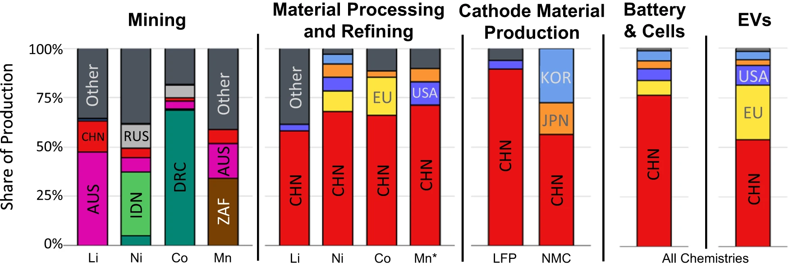
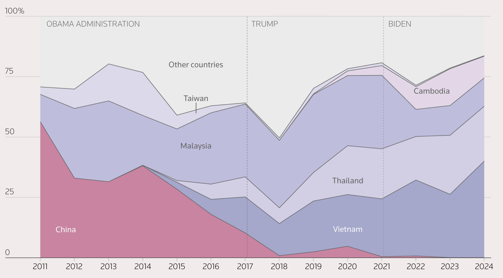
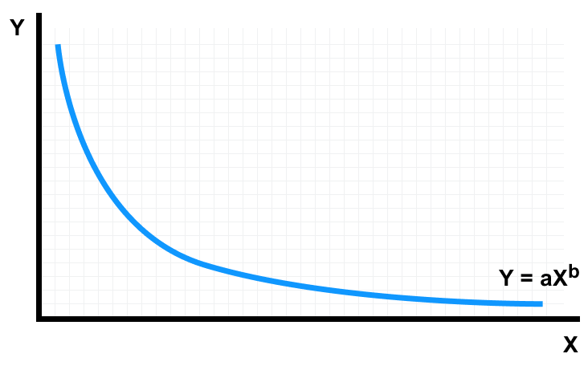

```{r, child="setup.Rmd"}
```

layout: true

<!-- this adds the link footer to all slides, depends on my-footer class in css-->

<div class="footer-small">
<span>
© John Paul Helveston, The George Washington University, June 2025
</span>
</div>

---

background-image: url("images/blue.jpg")
background-size: cover
class: inverse

<br><br><br><br>

## `r rmarkdown::metadata$title`

<br><br><br><br>

**.white[John Paul Helveston]**, George Washington University

`r rmarkdown::metadata$date`

---

class: middle, center, inverse

# What if the free flow of<br>capital, talent, and innovation across stops?

---

# .center[A Changing Reality]

<br>

--

.leftcol[

### .center[**2000s Globalization**]

Free flow of capital, talent, innovation

- Technology spillovers across borders
- Global learning curves
- Efficiency through comparative advantage

]

--

.rightcol[

### .center[**2020s National Fragmentation**]

Economic nationalism collides w/clean tech

- Economic security concerns
- Defense concerns ("Dual Use")
- Industrial policy competition
- "Friend-shoring" supply chains

]

---

class: middle

# .center[The political reality of how we got here]

<br><br>

## - Manufacturing job loss
## - China's rise
## - War (live and threats)

---

## .center[Manufacturing job loss (~5M since 2000)]

- Long term economic transition towards services
- "Hollowing out" of US industrial base

<center>

</center>

https://en.wikipedia.org/wiki/Manufacturing_in_the_United_States

---

## .center[Rise Chinese dominance in clean tech _supply chains_]

.leftcol[

#### .center[EV battery supply chain]

<center>

</center>

.font60[Cheng, Anthony L., et al. "Electric vehicle battery chemistry affects supply chain disruption vulnerabilities." Nature Communications 15.1 (2024): 2143.]

]

.rightcol[

#### .center[Solar module supply chain]

<center>

</center>

.font60[IEA Special report 2022: Solar PV Global Supply Chains, https://www.iea.org/reports/solar-pv-global-supply-chains]

]

---

### .center[War in Ukraine]

.leftcol[

- Drones now a clear tactical advantage
- Reliance on Chinese supply now a defense issue

<center>

</center>

.font80[https://www.bbc.com/news/articles/ckgn47e5qyno]

]

.rightcol[

<center>

</center>

.font80[https://arc-group.com/china-thriving-drone-industry/]

]

---

class: middle, center, inverse

# New Political Reality:

<br>

# Nationalism > Globalization

## (Security > Efficiency)

---

class: inverse, middle, center

# Solar PV

---

# Phase 1: Early Trade War (2010-2015)

### US a major solar manufacturer and polysilicon producer

- 2012: Obama imposes 24-36% anti-dumping tariffs on Chinese solar panels, citing unfair government subsidies.
- China retaliates with tariffs on US polysilicon exports.
- Chinese manufacturers continue scaling, US polysilicon industry contracts.

---

# Phase 2: Circumvention Era (2015-2020)

- China becomes dominant manufacturer, 80%+ of solar supply chain
- Chinese companies increasingly used "transhipment" through Malaysia, Thailand, and Vietnam to avoid US tariffs
- US looses significant market share.
- Tariffs remain, but effectiveness diminished due to circumvention

---

class: center, middle

## Shift from China to SE Asia (Transhipment)

<center>

</center>

.font80[Source: https://www.reuters.com/graphics/USA-CHINA/SOLAR-HISTORY/gdpzkdeqlvw/]

---

## .center[Shift from China to SE Asia (Transhipment)]

.leftcol40[

### Chinese firms still leading producers, but manufacturing shifts to SE Asia to skirt US tariffs

<br><br><br><br>

.font80[Source: https://www.reuters.com/graphics/USA-CHINA/SOLAR-HISTORY/gdpzkdeqlvw/]

]

.rightcol60[

<center>

</center>

]

---

## .center[Shift from China to SE Asia (Transhipment)]

.leftcol40[

### Solar prices in US are much higher than in China

<br><br><br><br><br><br>

.font80[Source: https://www.reuters.com/graphics/USA-CHINA/SOLAR-HISTORY/gdpzkdeqlvw/]

]

.rightcol60[

<center>

</center>

]

---

# .center[**Bipartisan goal**: The US needs to counter China's lead in clean energy tech]

<br>

--

## **Keep Chinese clean tech out of US market**: Steep tariffs on imported PV modules

--

## **Offer tax credits for domestic solar manufacturing**: IRA credits 30%...

---

## Solar PV

### Total available U.S. federal subsidies: $0.16 / W

### Average U.S. module price (Q1 2024): $0.33 / W

<br><br><br><br>

Sources:

- https://www.nrel.gov/docs/fy24osti/91209.pdf
- Michael Davidson, “U.S.-China Clean Energy Race: Accelerating Innovation, Manufacturing and Adoption”, https://web.sas.upenn.edu/future-of-us-china-relations/climate-and-environment/

---

## Solar PV

### Total available U.S. federal subsidies: $0.16 / W

### Average U.S. module price (Q1 2024): $0.33 / W

### Average cost of production in China: **$0.10 / W**

<br><br>

Sources:

- https://www.nrel.gov/docs/fy24osti/91209.pdf
- Michael Davidson, “U.S.-China Clean Energy Race: Accelerating Innovation, Manufacturing and Adoption”, https://web.sas.upenn.edu/future-of-us-china-relations/climate-and-environment/

---

## Solar PV

### Total available U.S. federal subsidies: $0.16 / W

### Average U.S. module price (Q1 2024): $0.33 / W

### Average cost of production in China: $0.10 / W

### **Risk: U.S. producers unlikely to be globally competitive**

Sources:

- https://www.nrel.gov/docs/fy24osti/91209.pdf
- Michael Davidson, “U.S.-China Clean Energy Race: Accelerating Innovation, Manufacturing and Adoption”, https://web.sas.upenn.edu/future-of-us-china-relations/climate-and-environment/

---

class: middle, center, inverse

## Remember?

## Nationalism > Globalization

(Security > Efficiency)

---

background-color: #fff

## Solar unlikely to produce desired # of manufacturing jobs

.leftcol70[

<center>

</center>

]

.rightcol30[

### Installation and project development accounts for 2/3 of solar jobs.

### **Manufacturing is 12% of solar jobs**

.footer[https://irecusa.org/census-solar-job-trends/]

]

---

# We need diversification

## China has enough solar PV capacity to meet annual global demand through 2032.

Source: Wood Mackenzie, https://www.reuters.com/world/china/china-will-dominate-solar-supply-chain-years-wood-mackenzie-2023-11-07/

--

<br>

## But do we need _onshoring_?

---

#### .center[Estimated $67 B in savings from global supply chains]

<center>

</center>

Helveston, J.P., He, G., & Davidson, M.R. (2022) “Quantifying the cost savings of global solar photovoltaic supply chains” _Nature_. 612 (7938), pg. 83-87. DOI: [10.1038/s41586-022-05316-6](https://doi.org/10.1038/s41586-022-05316-6)

---


---

background-color: #FFFFFF

## .center[Learning curve model]

<center>

</center>

---

background-color: #FFFFFF

## .center[Learning curve model]

.leftcol60[

<center>

</center>

]

.rightcol40[

In context of solar PV:

- X: Cumulative installed cap.
- Y: = Price per kW

<br>

Log transformation:

$$\ln Y = \ln a + b \ln X$$

]

---

## Two-factor learning curve model:

<br>

## $$\ln p_{it} = \ln \alpha_i + \beta_i \ln q_{t} + \gamma_i \ln s_{t} + \varepsilon_{it}$$

<br>

## price ($ / kW) = intercept + installed capacity + silicon price

## for country _i_ and year _t_

---

## Two-factor learning curve model:

<br>

## $$\ln p_{it} = \ln \alpha_i + \beta_i \ln q_{t} + \gamma_i \ln s_{t} + \varepsilon_{it}$$

<br>

## Learning rate:

## $$L_i = 1 - 2^{\beta_i}$$

---

class: middle

## .center[Data Sources]

Country | Data | Source
--------|-----|----------------
Global | Installed PV capacity and prices | International Renewable Energy Agency (IRENA)
U.S. | Installed capacity | Solar Energy Industries Association (SEIA)
U.S. | Module prices  | Lawrence Berkeley National Laboratory (LBNL) & National Renewable Energy Laboratory (NREL)
China | Installed capacity & module prices | Energy Research Institute (ERI) & China Photovoltaic Industry Association
Germany | Installed capacity | IRENA
Germany | Module prices | Fraunhofer ISE50

All prices are in $2020 USD<br>(inflation adjustments from IMF, exchange rates from Federal Reserve Bank)

---

## Model results

|                                     | United States        | China                | Germany              |
| ----------------------------------- | -------------------- | -------------------- | -------------------- |
|                                     | Est. (Std. Err.)     | Est. (Std. Err.)     | Est. (Std. Err.)     |
| (Intercept)                         | 15 (1.04)\*\*\*      | 18 (1.58)\*\*\*      | 12 (0.96)\*\*\*      |
| log(cum\_capacity\_kw)              | \-0.44 (0.045)\*\*\* | \-0.57 (0.070)\*\*\* | \-0.33 (0.042)\*\*\* |
| log(price\_si)                      | 0.15 (0.058)\*       | 0.23 (0.079)         | 0.21 (0.054)         |

## Learning rates: $L_i = 1 - 2^{\beta_i}$

- U.S.: 26%
- China: 33%
- Germany: 20%

---

class: center, middle
background-color: #FFFFFF

## U.S.: 26%; China: 33%; Germany: 20%

<center>

</center>

---

## .center["National Markets" Counterfactual Scenario]

**Assumption**: learning-related price decreases in country _i_ in year _t_ are derived from incrementally more nationally-installed PV capacity

## $$q_t - q_{t-1} = (q_{it} - q_{it-1}) + (1 - \lambda_t) (q_{jt} - q_{jt - 1})$$

## $(q_{it} - q_{it-1})$: Amount installed in country _i_
## $(q_{jt} - q_{jt-1})$: Amount installed in all other countries

---

class: center

## $$q_t - q_{t-1} = (q_{it} - q_{it-1}) + (1 - \lambda_t) (q_{jt} - q_{jt - 1})$$

<br>

.leftcol[

## **Global markets**

$\lambda_t = 0$

Capacity from all countries

$$(q_{it} - q_{it-1}) + (q_{jt} - q_{jt - 1})$$

]

.rightcol[

## **National markets**

$\lambda_t = 1$

Capacity only from country _i_

$$(q_{it} - q_{it-1})$$

<br>

$\lambda_t$ -> 1 over 10-year period

]

---

class: middle
background-color: #FFFFFF

<center>

</center>

**Higher prices in 2020**:

- 54% higher in China ($387 versus $250 per kW)
- 83% in higher Germany ($652 versus $357 per kW)
- 107% higher in the U.S. ($877 versus $424 per kW)

---

class: middle, center
background-color: #FFFFFF

## **Total Savings: $67 billion ($50 - $84 billion)**

<center>

</center>


---


# .center[Same tensions in every low-carbon technology]

## .center[China is manufacturing leader in almost every sector]

.font120[

Technology | Scale
----|------
Solar Panels | From 1% to 70% (2001 - 2019)
Wind Turbines | 1/3 of global supply (2020)
Electric Vehicles | 51% of global sales (2021)
Lithium-ion Batteries | 70% of global production (76% by 2025)
Nuclear Reactors | From 45 to 88 plants by 2030

]

---

class: middle, center

# So what do we do about this tension?

---

# Climate Clubs: A Potential Solution?

<br>

### **The Concept**: Coalitions of willing countries

- Coordinated climate action
- Preferential trade treatment for members
- Burden sharing for global public goods

--

<br>

### **Trade Dimension**:

- Lower tariffs within the club
- Common standards and regulations
- Technology sharing agreements

--

<br>

### **The Challenge**: Balancing cooperation with competition

---

# The Trilemma

<br>

.leftcol[

### **Three Goals**:

1. **Climate Action**: Speed and scale
2. **Economic Competitiveness**: Domestic benefits
3. **Technology Sovereignty**: Strategic autonomy

]

--

.rightcol[

### **Reality**:

Cannot optimize all three simultaneously

### **Policy Question**:

How to sequence and prioritize?

]

---

# Research and Modeling Implications

<br>

### **Current Models Assume**:

- Frictionless technology transfer
- Global learning curves
- Minimal trade barriers

--

<br>

### **New Reality Requires**:

- Political economy constraints
- Fragmented innovation systems
- Trade policy feedbacks

--

<br>

### **Research Priorities**:

- Extending analysis to other clean technologies
- Designing effective climate clubs
- Updating Integrated Assessment Models

---

class: middle, center

# Key Takeaways

---

# Three Main Points

<br>

### **1. Globalization delivered massive cost savings**

$67 billion for solar PV alone (2008-2020)

--

<br>

### **2. Fragmentation will slow progress and increase costs**

20-25% higher prices by 2030 under national scenarios

--

<br>

### **3. Models need updating to reflect new trade realities**

Political economy cannot be ignored

---

class: middle, center, inverse

# The question isn't whether countries will pursue industrial policy (they already are)

# The question is whether we can design these policies to preserve the global cooperation that made clean technology affordable in the first place.

---

class: inverse
background-image: url("images/blue.jpg")
background-size: cover

<br>

# Thanks!

<br>

### <span class="white-text">Questions?</span>

<style>
.white-text a {
  color: white !important;
}
</style>

.footer-large[.white[.right[

@jhelvy.bsky.social `r fa(name = "bluesky", fill = "white")`<br>
@jhelvy `r fa(name = "github", fill = "white")`<br>
jhelvy.com `r fa(name = "link", fill = "white")`<br>
jph@gwu.edu `r fa(name = "paper-plane", fill = "white")`

]]]

